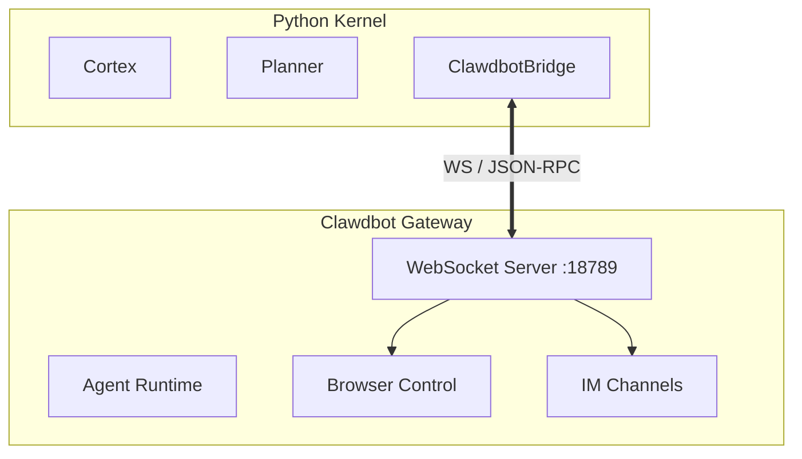

# Yoyoo <-> Clawdbot Integration Specification

**Status**: Draft
**Date**: 2026-01-27
**Based on**: Clawdbot v0.x Source Analysis

## 1. Architecture Overview

Yoyoo operates as a **Project Centaur** system:
- **Brain (Python)**: High-level cognition, memory, planning.
- **Body (Clawdbot/Node.js)**: Execution gateway, browser control, IM channels.

The integration is achieved by the Brain connecting to the Body's Gateway as a privileged **Operator Client**.



## 2. Connection Protocol

The Brain connects to `ws://127.0.0.1:18789` (default).

### 2.1 Handshake (The "Hello" Dance)

1. **Connect**: Brain opens WebSocket.
2. **Challenge** (Optional): Gateway sends `{"type": "event", "event": "connect.challenge", ...}`.
3. **Login**: Brain sends `connect` request frame.

**Connect Payload:**
```json
{
  "type": "req",
  "id": "init-1",
  "method": "connect",
  "params": {
    "minProtocol": 1,
    "maxProtocol": 1,
    "client": {
      "id": "yoyoo-brain",
      "version": "0.1.0",
      "platform": "darwin",
      "mode": "backend",
      "displayName": "Yoyoo Brain Kernel"
    },
    "role": "operator",
    "scopes": ["operator.admin", "operator.read", "operator.write"],
    "auth": {
      "token": "YOUR_AUTH_TOKEN" 
    }
  }
}
```

*Note: Auth token must match `clawdbot-safe-config.json` or generated device token.*

### 2.2 Heartbeat

Clawdbot expects a `tick` event or general activity.
- Gateway sends `{"type": "event", "event": "tick", ...}`
- Brain must ensure connection stays alive (standard WS ping/pong or responding to ticks).

## 3. Capability Mapping

### 3.1 Browser Control (The Eyes & Hands)
**Goal**: Use Clawdbot's managed Chrome instance.

* **Method**: `node.invoke`
* **Target Node**: The Gateway itself (it runs the browser).

**Request:**
```json
{
  "method": "node.invoke",
  "params": {
    "nodeId": "gateway", // or specific connected node ID
    "method": "browser.open",
    "params": {
      "url": "https://google.com"
    }
  }
}
```

### 3.2 Messaging (The Mouth)
**Goal**: Send messages via WhatsApp/Telegram/etc.

* **Method**: `chat.send` or `send`

**Request:**
```json
{
  "method": "chat.send",
  "params": {
    "to": "whatsapp:+1234567890",
    "message": "Hello from Yoyoo Brain!",
    "typing": true
  }
}
```

### 3.3 System Ops (The Hands)
**Goal**: File IO, Shell commands.

* **Method**: `node.invoke`
* **Capability**: `system.run`

**Request:**
```json
{
  "method": "node.invoke",
  "params": {
    "method": "system.run",
    "params": {
      "command": "ls -la"
    }
  }
}
```

## 4. Event Handling (Senses)

The Brain subscribes to events from the Gateway.

| Clawdbot Event | Yoyoo Signal Type | Description |
|----------------|-------------------|-------------|
| `chat.message` | `stimulus.chat` | Incoming IM message |
| `node.event` | `stimulus.system` | Device status change |
| `cron.run` | `stimulus.time` | Scheduled task trigger |

**Payload Structure (Incoming):**
```json
{
  "type": "event",
  "event": "chat.message",
  "payload": {
    "from": "whatsapp:+123...",
    "text": "Hey Yoyoo!",
    "attachments": []
  }
}
```

## 5. Implementation Strategy

1. **`ClawdbotBridge` Class**:
   - Manages WS connection.
   - Handles `connect` handshake automatically.
   - Exposes `call(method, params)` -> Promise.
   - Dispatches incoming events to `EventBus`.

2. **Skill Proxies**:
   - `@registry.register` decorators for Python functions that wrap `bridge.call()`.
   - Example: `def open_browser(url): bridge.call("node.invoke", ...)`

3. **Authentication**:
   - We need to locate or generate a valid Operator Token from Clawdbot's local config (`~/.clawdbot/credentials` or `config.json`).

## 6. Verification Plan

1. **Dry Run**: Connect dummy script to Gateway.
2. **Auth Check**: Verify `operator.admin` scope acquisition.
3. **Echo Test**: Send message to self/log via Gateway.
